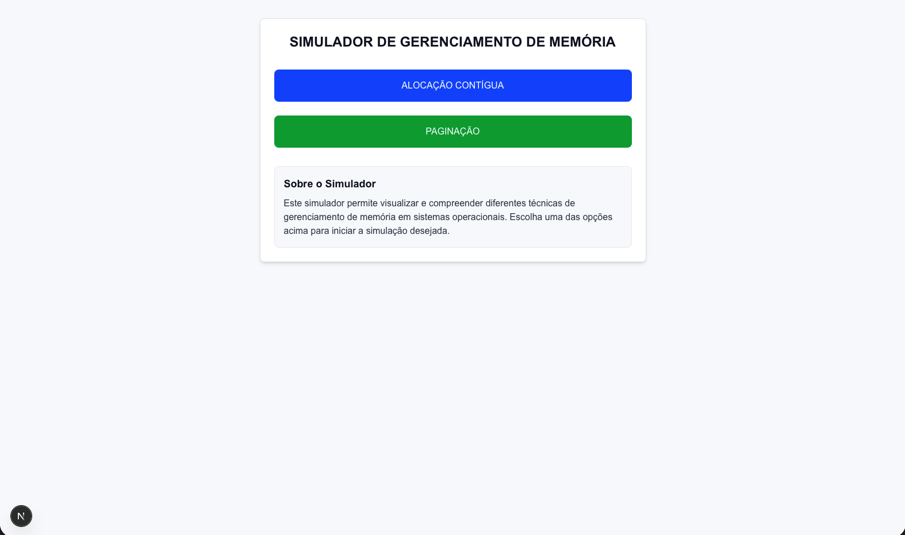
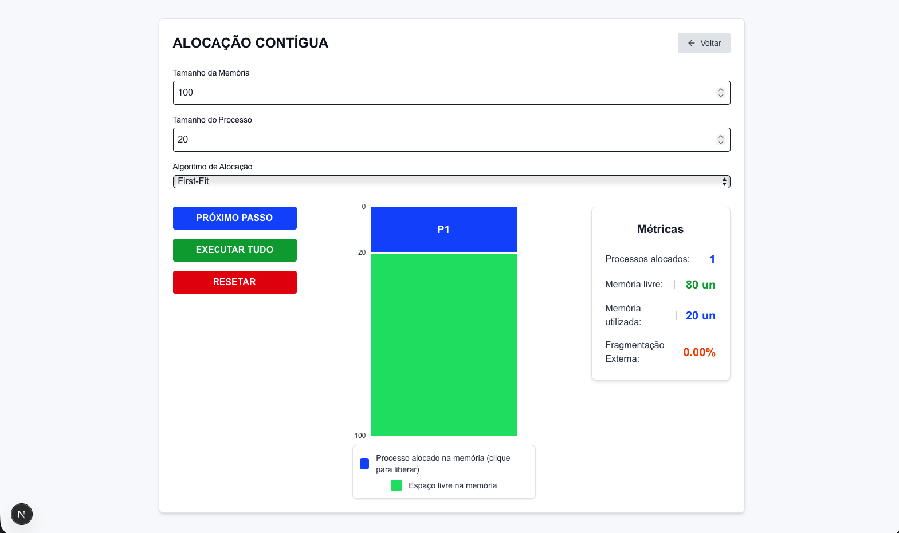
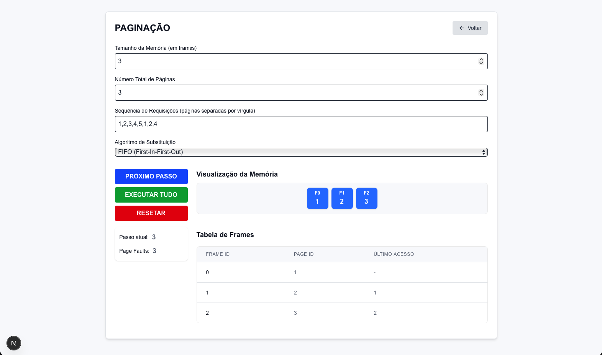

# Simulador de Gerenciamento de Memória

## Integrantes

- Fabio Santos
- Ricardo Risson Machado

## Descrição do Projeto

Este projeto é um simulador de gerenciamento de memória que implementa dois modos principais de operação:

1. **Alocação Contígua Dinâmica**

   - Algoritmos First-Fit, Best-Fit, Worst-Fit e Circular-Fit
   - Visualização de fragmentação de memória
   - Criação e remoção de processos

2. **Paginação Pura**
   - Gerenciamento de páginas e frames
   - Tabela de páginas
   - Mapeamento de endereços

O simulador oferece uma interface interativa para demonstrar conceitos fundamentais de gerenciamento de memória em sistemas operacionais.

## Tecnologias Utilizadas

- **Frontend**: React.js + Next.js 14
- **Linguagem**: TypeScript
- **Estilização**: Tailwind CSS
- **Componentes**: Radix UI
- **Interface**: Web-based (Browser)

## Dependências

```json
{
  "dependencies": {
    "next": "14.0.4",
    "react": "^18",
    "react-dom": "^18",
    "@radix-ui/react-radio-group": "^1.1.3",
    "@radix-ui/react-label": "^2.0.2",
    "@radix-ui/react-select": "^2.0.0"
  },
  "devDependencies": {
    "typescript": "^5",
    "tailwindcss": "^3.3.0",
    "eslint": "^8",
    "postcss": "^8"
  }
}

Instalação e Execução

    Clone o repositório:

git clone https://github.com/fabioov/so_memory_mgmt
cd so_memory_mgmt

Instale as dependências:

npm install

Execute o servidor de desenvolvimento:

npm run dev

Acesse o simulador:
Abra http://localhost:3000

    no seu navegador

Arquitetura e Decisões de Projeto
Estrutura do Projeto

so_memory_mgmt/
├── src/
│   ├── app/              # Páginas e rotas
│   ├── components/       # Componentes reutilizáveis
│   ├── hooks/           # Custom hooks
│   └── utils/           # Funções utilitárias
├── public/              # Arquivos estáticos
└── styles/             # Estilos globais

Decisões Técnicas

    Next.js App Router: Utilizado para melhor performance e SEO

    TypeScript: Tipagem estática para maior segurança e manutenibilidade

    Tailwind CSS: Estilização rápida e consistente

    Radix UI: Componentes acessíveis e customizáveis

Padrões de Projeto

    Componentização modular

    Custom hooks para lógica reutilizável

    Context API para gerenciamento de estado

    Princípios SOLID e Clean Code

Screenshots e Exemplos de Uso
Página Inicial


Modo de Alocação Contígua


Modo de Paginação


Funcionalidades
Alocação Contígua

    Configuração do tamanho total da memória

    Seleção de algoritmos de alocação

    Visualização de fragmentação

    Estatísticas de uso de memória

Paginação

    Definição do tamanho das páginas

    Visualização da tabela de páginas

    Mapeamento de endereços lógicos/físicos

    Estatísticas de paginação

Contribuição

Para contribuir com o projeto:

    Faça um fork do repositório

    Crie uma branch para sua feature

    Faça commit das mudanças

    Push para a branch

    Abra um Pull Request

Repositórios

    GitHub: https://github.com/fabioov/so_memory_mgmt
```
